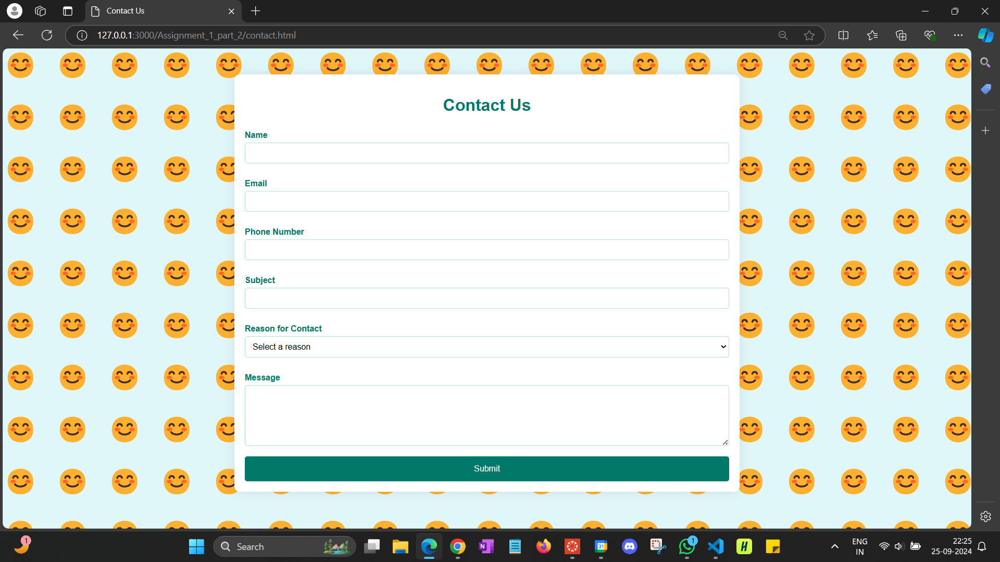

# CMPE-255
## Assignment 1

Link to all the recordings: 
https://drive.google.com/drive/folders/1IES_zSVIpU9nujguUBmu13mG__CoXzY1?usp=sharing

link to akkio prediction report:
https://app.akkio.com/project/7134a110-1df9-466c-b485-fdb6763e423a/1/report

for the third part of the assignment where I use AutoML no code solution (akkio) for
health risk index predictio, the data set used is Urban Air Quality and Health Impact Dataset
from Kaggle data sets (link: https://www.kaggle.com/datasets/abdullah0a/urban-air-quality-and-health-impact-dataset)

for the second part of the assignment, the opening page is Ebay_com.html
screen shots include:
